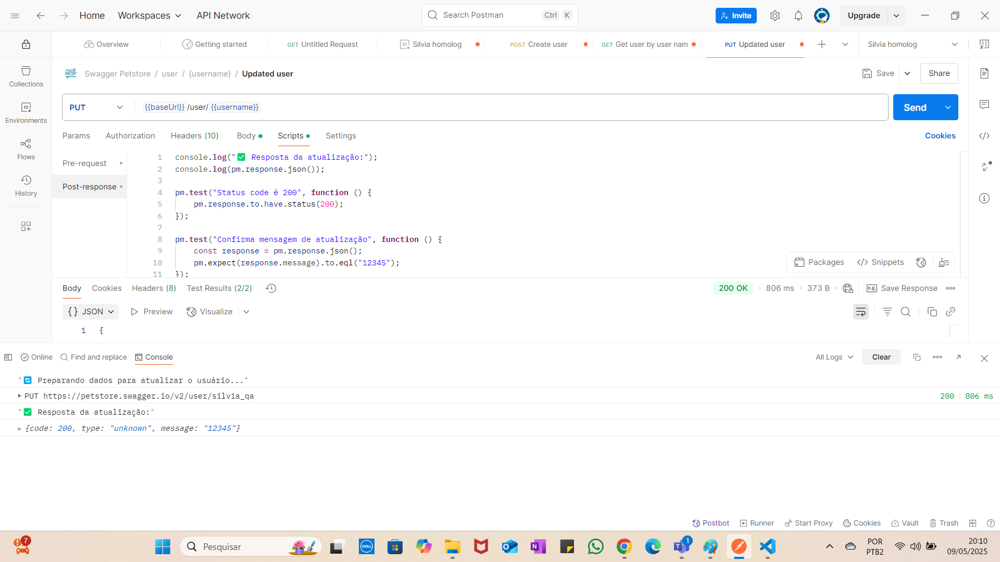

# 🧪 Testes de API – Swagger Petstore com Postman

## 🔄 Exercício 3 – Atualizar usuário (Update)

Neste teste, o usuário criado anteriormente é atualizado via método PUT. As variáveis são definidas no Pre-request Script e utilizadas no corpo da requisição (body), com validações na aba de testes.

### 🔹 PUT  
`{{baseUrl}}/user/{{username}}`

---

### 🔧 Pré-requisito (Pre-request Script)

```javascript
console.log("🔄 Preparando dados para atualizar o usuário...");

pm.variables.set("username", "silvia_qa");
pm.variables.set("firstName", "SilviaAtualizada");
pm.variables.set("lastName", "CunhaNova");
pm.variables.set("email", "silvia.atualizada@example.com");
pm.variables.set("phone", "11999998888");

📦 Body (JSON)

{
  "id": 12345,
  "username": "{{username}}",
  "firstName": "{{firstName}}",
  "lastName": "{{lastName}}",
  "email": "{{email}}",
  "password": "novaSenha123",
  "phone": "{{phone}}",
  "userStatus": 1
}

🧪 Testes

console.log("✅ Resposta da atualização:");
console.log(pm.response.json());

pm.test("Status code é 200", function () {
    pm.response.to.have.status(200);
});

pm.test("Confirma mensagem de atualização", function () {
    const response = pm.response.json();
    pm.expect(response.message).to.eql("12345");
});

📸 Console Postman


📁 Arquivos incluídos
collection.json – Collection exportada do Postman
README.md – Explicação do exercício

🚀 Próximos passos
✅ Deletar usuário

Em breve aqui também!

