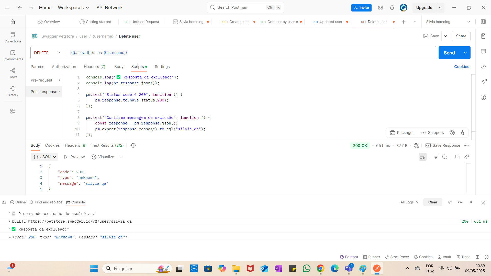

# 🧪 Testes de API – Swagger Petstore com Postman

## ✅ Exercício 4 – Deletar usuário (Delete)

Neste teste, um usuário é deletado. O nome do usuário é definido no Pre-request Script e utilizado na URL do método DELETE.

# DELETE
{{baseUrl}}/user/{{username}}

### 🔧 Pré-requisito (Pre-request Script)

console.log("🗑️ Preparando exclusão do usuário...");

pm.variables.set("username", "silvia_qa");

🧪 Testes
console.log("✅ Resposta da exclusão:");
console.log(pm.response.json());

pm.test("Status code é 200", function () {
    pm.response.to.have.status(200);
});

pm.test("Confirma mensagem de exclusão", function () {
    const response = pm.response.json();
    pm.expect(response.message).to.eql("silvia_qa");
});

📸 Console Postman

---

## 📁 Arquivos incluídos
collection.json – Collection exportada do Postman
README.md – Explicação do exercício

E FIMMMMMMMMMMMMMMMMMMMMMMMMMM
🚀🚀🚀🚀🚀🚀🚀🚀🚀🚀🚀🚀🚀🚀🚀🚀🚀🚀🚀
